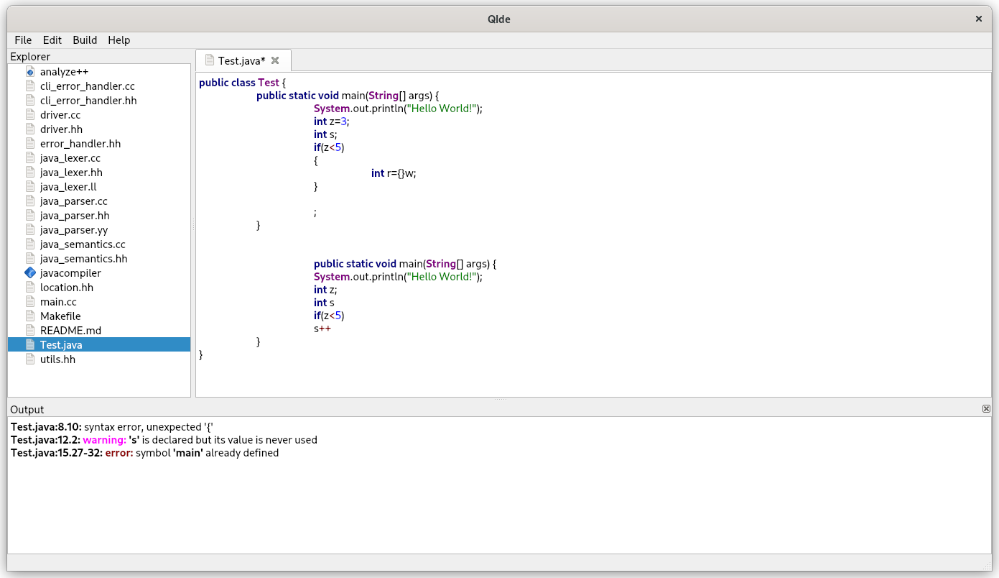

# QIde

## Overview

This is a mini java compiler. Written in Flex (Lex) and Bison (Yacc). In addition to a GUI written in QT6 and Qt Widgets



## Technical Overview


### Core

The `QIde-core` represents the core functionalities of the compiler. It accepts text from a file, **analyzes** it and generates the appropriate **syntax** and **semantic** errors.

It's possible to run The Core application as a standalone. For more instructions check [The Core README](./QIde-core/README.md)

#### Components

- The analyzer is written in `flex`

- The syntax scanner is written in `bison`. Based on a minified version of the java Grammar

- The semantic analysis uses a `symbol table` : a `list` of `hashmap` ( each represeting a scope ). Check the [source code](./QIde-core) for more info

### GUI

The `QIde-gui` represents the Gui application. The Gui is written entirely in Qt 6 and Qt Widgets. No Ui files have been used in the process ( meaning all the components are written as code, offering more flexibility). For more information check [The Gui README](./QIde-gui/README.md)


## Build 

The entire project is built with `cmake `(linking the core and the gui sources). 

To compile from source start by running 

```bash
cmake . -B build
```

---
### Note

If there is an issue with Qt not being found, do one of the following:
- Add `QT_DIR`  as an environment variable and call cmake again
- Or, you can call cmake with the following additional argument `-DCMAKE_PREFIX_PATH=/path/to/qt/gcc`, or any other compiler used by cmake

---

This will generate some build files. Based on your system and on the available **Build system Generator** the next command might differ. If you're using `make` as a build generator ( changed in the cmake config ) then simply run

```bash
cd build
make
```

## Usage

After the build phase, a binary `QIde` will be generated. That's your **entry point** to the Gui application. You'll only have to execute it:

```bash
./QIde
``` 

